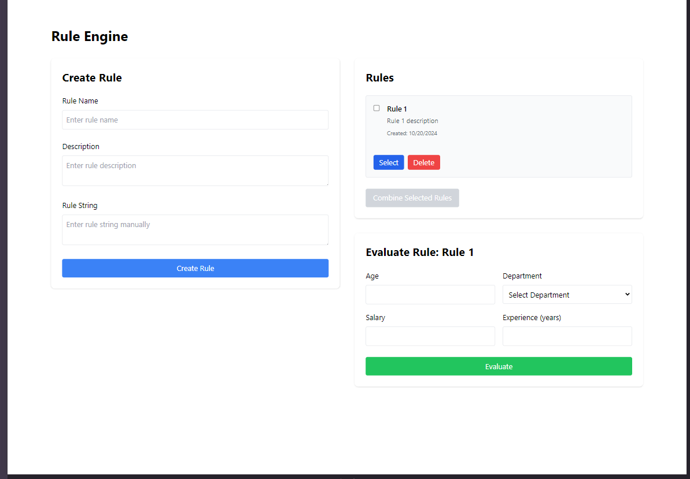
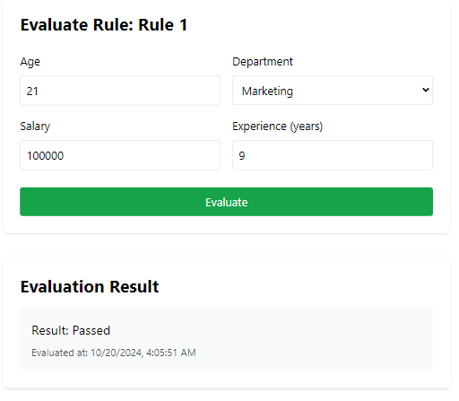

# Rule Engine API with AST (Abstract Syntax Tree) Representation

## 1. Project Description

The **Rule Engine API** is a powerful system for creating, managing, and evaluating business rules using **Abstract Syntax Trees (AST)**. Built with **Node.js**, **TypeScript**, **Express**, and **MongoDB**, this system enables dynamic rule creation, rule combination, and real-time evaluation via RESTful APIs. The frontend, powered by **React** and **Vite**, provides an intuitive interface for managing and evaluating rules.

---

## 2. Live Demo

- **Frontend Live Link**: [Frontend Application Live Demo](http://localhost:5173) (Running on Vite)
- **Backend API Documentation**: [Backend API Live Docs](http://localhost:8000) (Express API)

---

## 3. Screenshots


### Frontend Overview

### Rule Creation UI


### Rule Evaluation Result


---

## 4. Features

### Frontend (React + Vite)
- 🌟 **Rule Creation**: Easily create dynamic business rules via an intuitive UI.
- 🔎 **Rule Evaluation**: Input custom data and get real-time evaluation results.
- 📊 **Rule Combination**: Combine multiple rules to handle complex logic.
- 🎨 **Responsive Design**: Built with **Tailwind CSS** for a modern, responsive UI.
- ⚡ **Fast Build & Hot Reloading**: Using **Vite** for quick development and deployment.

### Backend (Node.js + Express)
- 🌳 **AST-based rule representation**: Efficient rule handling via AST.
- 📝 **Dynamic rule creation and combination**: Use API endpoints to manage and combine rules.
- 🔍 **Type-safe implementation**: Built with **TypeScript** for robust type-checking.
- 🛡️ **Security**: Input validation, MongoDB injection prevention, and rate-limiting for APIs.
- 🗄️ **MongoDB persistence**: Rules and evaluations are stored in MongoDB.
- 🚀 **RESTful API**: Full CRUD operations for rule management and evaluation.

---

## 5. Prerequisites

Before you begin, ensure you have the following installed:

- **Node.js** (v14 or higher)
- **MongoDB** (v4.4 or higher)
- **npm** or **yarn** package manager
- **Docker** (for Docker Compose instructions)

---

## 6. Setup Instructions Without Docker

To set up the project locally without Docker, follow these steps:

### Backend Setup (Running on Port 8000)

1. **Clone the repository**:
   ```bash
   git clone https://github.com/mysteryhawk17/rule-engine-ast.git
   cd rule-engine-ast/backend
   ```

2. **Install dependencies**:
   ```bash
   npm install
   ```

3. **Create a `.env` file** in the `backend` root directory with the following content:
   ```env
   PORT=8000
   MONGODB_URI=mongodb://localhost:27017/rule-engine
   ```

4. **Build the TypeScript code**:
   ```bash
   npm run build
   ```

5. **Start the backend server**:
   ```bash
   npm start
   ```

6. **Run in development mode (optional)**:
   ```bash
   npm run dev
   ```

### Frontend Setup (Running on Port 5173)

1. **Navigate to the frontend directory**:
   ```bash
   cd ../frontend
   ```

2. **Install frontend dependencies**:
   ```bash
   npm install
   ```

3. **Start the Vite development server**:
   ```bash
   npm run dev
   ```

4. **Access the frontend** at `http://localhost:5173`.

---

## 7. Instructions to Run the App Using Docker Compose

Follow these instructions to set up the application using Docker Compose, which will run the frontend, backend, and MongoDB in separate containers.

1. **Ensure Docker and Docker Compose are installed**:
   - Docker: [Install Docker](https://docs.docker.com/get-docker/)
   - Docker Compose: [Install Docker Compose](https://docs.docker.com/compose/install/)

2. **Clone the repository**:
   ```bash
   git clone https://github.com/mysteryhawk17/rule-engine-ast.git
   cd rule-engine-ast
   ```

3. **Run Docker Compose**:
   ```bash
   docker-compose up --build
   ```

   This will start:
   - Frontend on **http://localhost:5173**
   - Backend on **http://localhost:8000**
   - MongoDB running in a container

4. **Stop the containers**:
   ```bash
   docker-compose down
   ```
